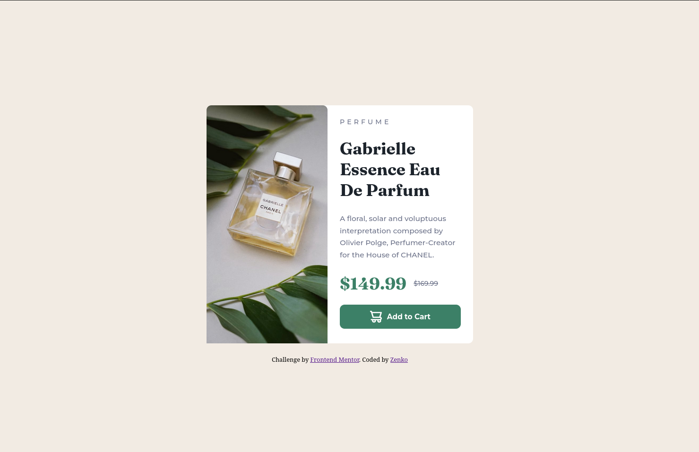

# Frontend Mentor - Product preview card component solution

This is a solution to the [Product preview card component challenge on Frontend Mentor](https://www.frontendmentor.io/challenges/product-preview-card-component-GO7UmttRfa). Frontend Mentor challenges help you improve your coding skills by building realistic projects.

## Table of contents

- [Overview](#overview)
  - [The challenge](#the-challenge)
  - [Screenshot](#screenshot)
  - [Links](#links)
- [My process](#my-process)
  - [Built with](#built-with)
  - [What I learned](#what-i-learned)
  - [Continued development](#continued-development)
  - [Useful resources](#useful-resources)
  - [AI Collaboration](#ai-collaboration)
- [Author](#author)
- [Acknowledgments](#acknowledgments)

## Overview

### The challenge

Users should be able to:

- View the optimal layout depending on their device's screen size
- See hover and focus states for interactive elements

### Screenshot




### Links

- Solution URL: [Add solution URL here](https://your-solution-url.com)
- Live Site URL: [Add live site URL here](https://your-live-site-url.com)

## My process

### Built with

- Semantic HTML5 markup
- CSS custom properties
- Flexbox
- CSS Grid
- Mobile-first workflow
- @media query
- Background-size Control

### What I learned

I first did mobile approach version to handle things smoothly. By doing this website, I learnt about controlling and adjusting the images that I wish to have. I also used classes in appropriate places.

I used div tags with class to manage images for different screen sizes. Below code is for responsive web design for mobile.

```
.image-box {
  background-image: url("images/image-product-mobile.jpg");
  border-radius: 0.8rem 0.8rem 0 0;
  width: 100%;
  height: 28rem;
  background-size: cover;
}
```

In larger screen sizes, I inserted another image with different size to show on larger screens.

```
.image-box {
    background-image: url("images/image-product-desktop.jpg");
    height: 100%;
    background-size: cover;
    background-position: center;
  }
```

I used img tag to insert cart icon beside "Add to cart" text.

```
<button>
  
  Add to Cart
</button>
```

## Author

- GitHub - [Zin Linn Htoo](https://github.com/ZinLinnHtoo-zenko)
- Frontend Mentor - [@Zenko](https://www.frontendmentor.io/profile/ZinLinnHtoo-zenko)
